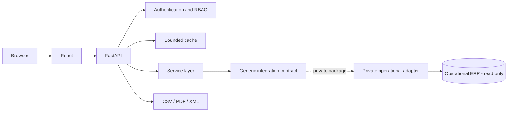

# Oncology Management Dashboard

> Full-stack healthcare operations platform focused on oncology production, billing traceability, financial reconciliation, denials management and account-level auditability.

This repository is a **sanitized portfolio edition** of a production-oriented healthcare analytics system. It preserves the architecture, domain model, data-flow design and engineering decisions while excluding credentials, patient data, institutional identifiers, operational SQL, ERP mappings, internal network information and environment-specific secrets.

**Current public edition: 0.7.0**

## Overview

Healthcare revenue-cycle data is rarely aligned to a single date or source. An oncology account can be produced in one period, billed in another competence, received later through one or more financial events and affected by denials or other adjustments.

The central objective is to make that lifecycle **traceable from operational production to financial outcome** without collapsing different business clocks into a misleading single-period view.

The application therefore treats these dimensions independently:

- production period;
- billing competence;
- financial receipt date.

## Engineering Goals

The project is organized around six priorities:

- **Financial correctness** — preserve the semantic difference between production, competence and receipt dates.
- **Traceability** — navigate from aggregated indicators to patient, encounter, account, billing batch and receipt-event detail.
- **Read-only integration** — consume healthcare ERP data through a private read-only adapter without creating a write path into the source system.
- **Operational performance** — reduce repeated source reads through bounded caching, lazy loading and adapter-backed service contracts.
- **Security by design** — local application authentication, RBAC, session management, CSRF protection and repository-hygiene checks.
- **Deployability** — support conventional Linux deployment patterns plus reproducible CI and a containerized synthetic demo.

## Run the Demo

The public demo uses deterministic synthetic data and does not require the private operational adapter.

```bash
cd frontend
npm ci
npm run demo
```

Open `http://localhost:4173`.

Docker:

```bash
docker compose -f docker-compose.demo.yml up --build
```

Open `http://localhost:8080`.

See [Portfolio demo guide](docs/DEMO.md).

## Technical Documentation

- [System guide](docs/SYSTEM_GUIDE.md) — architecture, domain semantics, security, performance, testing and deployment reference.
- [Public/private documentation boundary](docs/PUBLIC_PRIVATE_BOUNDARY.md) — rules for portfolio content and private operational material.
- [Architecture](docs/ARCHITECTURE.md)
- [Engineering decisions](docs/ENGINEERING_DECISIONS.md)
- [Analytical data model](docs/DATA_MODEL.md)
- [Security policy](SECURITY.md)
- [Changelog](CHANGELOG.md)

## Architecture



The public repository stops at the generic integration contract. The concrete ERP adapter, SQL, schema mappings, credentials and operational runbook are intentionally private.

### Technology stack

| Layer | Technology |
|---|---|
| Backend | Python, FastAPI |
| Integration | Generic adapter contract; private operational implementation omitted |
| Frontend | React, Vite |
| Visualization | Recharts |
| Authentication | Local application users, secure sessions, CSRF |
| Deployment model | Reverse proxy, application service supervision |
| Testing | Pytest + Node test runner |
| CI | GitHub Actions |
| Demo | Docker + deterministic synthetic data |

## Financial Data Model

A central modeling risk is comparing values that belong to different time dimensions.

The application explicitly separates:

- **Production period** — when oncology activity was produced.
- **Billing competence** — when the account or item entered the billing cycle.
- **Receipt date** — when the financial system registered a receipt event.
- **Denial/adjustment value** — value associated with a financial adjustment process.
- **Open balance** — remaining amount after accumulated receipts and applicable adjustments.

A public conceptual flow is:

```text
PatientEncounter
    ↓
AmbulatoryAccount
    ↓
BillingBatch
    ↓
InvoiceItem
    ↓
ReceiptEvent
    ├── ReceiptAdjustment
    └── AppealEvent
```

The application never treats billing or batch dates as financial receipt dates unless the underlying financial event supports that relationship.

## Core Capabilities

### Executive and operational dashboards

- oncology production indicators;
- billing-competence analysis;
- receipt metrics;
- aging indicators;
- denial monitoring;
- account-status summaries;
- production-to-financial traceability.

### Receipt reconciliation

- receipt-event aggregation;
- competence × receipt-month analysis;
- multiple-payment detection;
- account-level accumulated receipts;
- receipt aging and percentile indicators;
- drill-down into receipt-event composition.

### Account and patient traceability

```text
Patient
  → Encounter
    → Account
      → Billing Batch
        → Receipt Event
          → Adjustment
            → Current Balance
```

### Exports

- CSV;
- PDF;
- XML.

## Key Engineering Challenges

### Different business clocks

**Risk:** treating production, billing and receipt as if they belonged to the same accounting period.

**Approach:** every metric retains its native reference date and comparisons are made only when the business relationship is valid.

### Partial and delayed payments

**Risk:** a single account can be settled through multiple financial events across different months.

**Approach:** receipt events are accumulated by account while individual event history remains traceable.

### Operational source cost

**Risk:** analytical drill-downs can create repeated and expensive source reads.

**Approach:** lazy loading, bounded cache, TTLs, single-flight loading and explicit detail limits.

### Safe ERP integration

**Risk:** a public analytical application accidentally becomes coupled to or exposes a real operational database implementation.

**Approach:** the public application depends on a generic contract. The private adapter owns the real driver, SQL, schema mappings and environment configuration, and is read-only by design.

## Security Model

The public portfolio repository intentionally excludes:

- `.env` files;
- operational adapter credentials;
- database/session files;
- private keys and certificates;
- production exports, logs and backups;
- patient data;
- internal IP addresses, DNS names and filesystem paths;
- operational SQL and ERP schema mappings.

CI also rejects known private-adapter identifiers, personal-name references and common secret patterns.

## Performance Strategy

- bounded cache entries;
- TTL-based invalidation;
- single-flight loading;
- lazy frontend reads;
- explicit limits on detail endpoints;
- client-side filtering for already-loaded synthetic/analytical datasets.

The cache is an optimization layer, not a system of record.

## Repository Structure

```text
.
├── backend/
│   ├── app/
│   │   ├── api/
│   │   ├── auth/
│   │   ├── exports/
│   │   ├── integrations/
│   │   └── services/
│   ├── tests/
│   └── requirements.txt
├── frontend/
│   ├── public/
│   └── src/
├── deploy/
├── docs/
├── .github/
│   └── workflows/
├── .env.example
├── SECURITY.md
└── README.md
```

## Local Development

### Backend

```bash
cd backend
python3 -m venv .venv
source .venv/bin/activate
pip install -r requirements-dev.txt
pytest -q
```

The public backend intentionally ships without an operational adapter. Private deployments provide one separately with:

```text
DATA_ADAPTER=package.module:factory
```

Without that package, operational reads fail explicitly rather than silently falling back to guessed or embedded mappings.

### Frontend

```bash
cd frontend
npm ci
npm run dev
```

### Production build

```bash
cd frontend
npm ci
npm run build
```

## Validation

The CI pipeline validates:

- repository hygiene;
- backend lint and tests;
- frontend synthetic-data tests;
- production frontend build;
- synthetic demo build;
- demo-container build.

A change is not considered complete while CI is red.

## Design Principles

- Preserve business semantics before optimizing presentation.
- Never infer a bank-credit date from a billing date.
- Do not label billed value as hospital cost.
- Keep denial/adjustment and outstanding financial balance as separate concepts.
- Prefer auditable account-level drill-down over opaque aggregate KPIs.
- Keep the operational adapter read-only.
- Keep the concrete ERP implementation outside the public repository.
- Expose assumptions and limitations in public documentation without exposing operational mappings.

## Portfolio Context

This project demonstrates software engineering applied to a complex healthcare revenue-cycle problem: preserving financial date semantics, isolating a private system integration, securing access, optimizing repeated reads and presenting the result through an auditable analytical interface.

The public version is intentionally decoupled from any specific healthcare institution and contains no production data.

## License

This project is licensed under the [MIT License](LICENSE).
