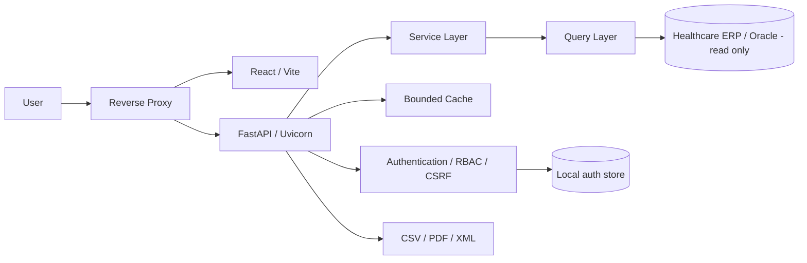

# System Guide

## Public Engineering Reference — Oncology Management Dashboard

> Public-safe reference for architecture, domain semantics, security, performance, testing, deployment strategy and engineering decisions.

This document intentionally describes the system at the architectural and domain level. Vendor-specific object names, production identifiers, internal infrastructure details, credentials, operational mappings and private troubleshooting procedures are excluded from the public repository.

---

## 1. Purpose

The Oncology Management Dashboard is a full-stack analytical platform designed to connect oncology production, billing, receipt events, denials and account-level traceability.

The central engineering rule is:

> A financial indicator is only useful when its date reference, business meaning and underlying composition are clear.

The application therefore treats operational production, billing competence and financial receipt as distinct dimensions instead of collapsing them into a single monthly total.

---

## 2. Business problem

A healthcare account can move through several independent stages:

```text
production
  ↓
billing
  ↓
remittance
  ↓
invoice item
  ↓
financial receipt
  ↓
denial / adjustment
  ↓
current balance
```

These stages do not necessarily occur in the same month.

A production event can happen in one period, be billed in another and be received later through one or more financial events.

The application was designed to make this lifecycle auditable from executive KPIs down to account-level details.

---

## 3. Core time dimensions

The system preserves three independent business clocks.

| Dimension | Meaning |
|---|---|
| Production period | when the oncology activity was produced |
| Billing competence | when the account or item entered the billing cycle |
| Receipt date | when the financial system registered the receipt |

The platform never assumes these dates are interchangeable.

This prevents misleading conclusions such as treating a receipt posted this month as if it necessarily belonged to this month's production or billing.

---

## 4. Domain model

The public domain abstraction is:

```text
OncologySchedule
      ↓
Attendance
      ↓
Patient
      ↓
AmbulatoryAccount
      ↓
Remittance
      ↓
InvoiceItem
      ↓
ReceiptAdjustment
      ↓
ReceiptEvent
      ↓
Denial / Balance
```

These names describe business roles rather than vendor-specific database objects.

### Main entities

**OncologySchedule**  
Identifies the oncology operational cohort.

**Attendance**  
Represents the clinical/operational encounter.

**Patient**  
Provides the patient-level aggregation key.

**AmbulatoryAccount**  
Represents the financial account associated with the attendance.

**Remittance**  
Groups accounts/items into the billing workflow.

**InvoiceItem**  
Acts as the bridge between billed values and financial events.

**ReceiptAdjustment**  
Represents the allocation of received amounts, additions, discounts or denial-related values to billed items.

**ReceiptEvent**  
Represents the financial receipt event and its registered receipt date.

---

## 5. Financial semantics

The system deliberately separates multiple monetary concepts.

### Billed value

Amount associated with the account or billing item.

It must not be described as hospital cost.

### Financial receipt

Gross amount associated with the financial receipt allocation.

### Base receipt

The analytical model separates additions from the base receipt:

```text
base receipt =
financial receipt - additions
```

### Estimated balance

```text
estimated balance =
max(billed - accumulated base receipts, 0)
```

### Denial-associated balance

```text
denial-associated balance =
min(estimated balance, accumulated denial value)
```

### Open financial balance

```text
open financial balance =
max(
  billed
  - accumulated base receipts
  - accumulated denial value,
  0
)
```

This prevents the common mistake of treating every difference between billed and received values as a denial.

---

## 6. Account financial states

The application derives analytical states such as:

| State | Meaning |
|---|---|
| No receipt | no accumulated base receipt |
| Received | remaining balance is effectively zero |
| Received with denial | remaining difference is explained by denial values |
| Partially received | financial balance remains open |
| Partially received with denial | both open balance and denial are present |

Small monetary tolerances are used to avoid classification errors caused by rounding.

---

## 7. Reversals and receipt history

Financial events can be reversed.

Reversed events are excluded from the normal accumulated receipt state.

They may still be available for audit purposes, but they must not inflate the current received amount.

The model also supports multiple receipt events for the same account or item.

Multiple receipts are not automatically considered an error; they may represent legitimate partial payments.

---

## 8. Competence × receipt analysis

One of the most important analytical views answers:

> From which billing competences did the amounts received in a selected month originate?

Conceptually:

```text
Billing competence A ─────┐
                          ├──► Receipt month X
Billing competence B ─────┘
```

This view preserves both dimensions and makes delayed receipts visible.

---

## 9. Historical account tracking

Production-oriented views start from a selected operational cohort.

Once the cohort is identified, the system follows those accounts through later financial events.

```text
selected production cohort
        ↓
billing competence
        ↓
later receipt events
        ↓
denials
        ↓
current balance
```

This allows a user to select an earlier production period and still see receipts that occurred afterward.

---

## 10. Audit rules

The system includes automated analytical checks for situations such as:

- account without an expected billing document;
- account without a financial receipt;
- operationally paid remittance without a matching receipt event;
- received value above the billed amount;
- partial receipt;
- receipt with denial;
- multiple receipt events.

These rules are indicators for investigation, not automatic proof of an error.

---

## 11. Receipt aging

Receipt aging measures elapsed time between the operational event and financial receipt.

The application exposes metrics such as:

- average days;
- median;
- 90th percentile;
- up to 30 days;
- 31–60 days;
- 61–90 days;
- above 90 days.

Percentiles are useful because financial receipt cycles are often asymmetric and a simple average can hide long-tail delays.

---

## 12. Architecture



### Technology stack

| Layer | Technology |
|---|---|
| Frontend | React, Vite |
| Charts | Recharts |
| Backend | Python, FastAPI |
| Application server | Uvicorn |
| Database integration | Oracle |
| Local auth state | SQLite |
| Reverse proxy | Apache-compatible deployment model |
| Testing | Pytest + Node test runner |
| CI | GitHub Actions |
| Container demo | Docker |

---

## 13. Backend structure

```text
backend/app/
├── api/
├── auth/
├── db/
├── exports/
├── models/
├── queries/
└── services/
```

### API layer

Responsible for:

- HTTP routes;
- request validation;
- authorization dependencies;
- limits;
- response handling.

### Query layer

Contains SQL organized by business domain.

The query layer is intentionally separated from route handlers so database-specific behavior does not leak across the application.

### Service layer

Responsible for:

- business rules;
- date semantics;
- metric composition;
- cache orchestration;
- financial classifications.

### Database layer

Responsible for:

- Oracle client initialization;
- connection pooling;
- executing read-only queries;
- transforming result sets into application records.

### Export layer

Supports structured reporting such as:

- CSV;
- PDF;
- XML.

---

## 14. Read-only ERP boundary

The application treats the healthcare ERP as the system of record.

The analytical connection is read-only by design.

The dashboard must not become a write path for:

- patients;
- attendances;
- accounts;
- billing;
- remittances;
- receipt events;
- denials.

Application-specific state such as users and sessions is kept outside the ERP.

---

## 15. Database protection strategy

Analytical applications can create significant load on operational databases.

The system therefore uses multiple controls.

### Small connection pool

The backend keeps the Oracle pool intentionally bounded.

The goal is not maximum concurrency; it is predictable, controlled access to the source ERP.

### Query limits

Detailed endpoints use explicit row limits.

### Maximum date range

The service layer rejects excessively large analytical periods.

### Lazy loading

Heavy detail queries are only executed when users open the corresponding view.

### Bounded cache

Frequently repeated analytical responses are cached with TTL and a maximum number of entries.

### Single-flight loading

Equivalent concurrent requests are serialized by key so the same expensive query is not unnecessarily executed multiple times at once.

---

## 16. Frontend strategy

The frontend is organized around executive visibility and drill-down.

Main functional areas include:

- integrated overview;
- accounts and patients;
- receipts;
- denials and pending items;
- analytics;
- reports;
- administration.

Large datasets are not loaded at application startup.

This reduces initial latency and protects the backend and source database.

---

## 17. Security model

### Application authentication

End users authenticate against the application, not directly against Oracle.

### Role-based access control

The system separates responsibilities into roles such as:

- administrator;
- billing operations;
- audit;
- read-only executive access.

### Password storage

Passwords are hashed with a memory-hard password derivation function and random salt.

Plain-text passwords are never stored.

### Sessions

Session tokens are random.

Only their hash is stored in the local authentication database.

Sessions have configurable expiration.

### CSRF

State-changing application operations use CSRF validation.

### Cookies

Production deployments should use secure cookie settings under HTTPS.

### CORS

Allowed origins should be explicit when credentials are enabled.

### Secrets

Credentials and environment-specific values are injected through environment configuration and are not committed to source control.

---

## 18. Auditability and observability

Each request can be correlated using a request identifier.

Application access logs include information such as:

- request ID;
- route;
- HTTP method;
- status;
- elapsed time.

The system also maintains authentication and administrative audit events in the application auth store.

---

## 19. Deployment model

The deployment design follows a conventional Linux pattern:

```text
Client
  ↓
Reverse proxy
  ├── static frontend
  └── /api
       ↓
   application server
       ↓
   Oracle / ERP
```

The application server listens only on the local interface in the production design and is exposed through the reverse proxy.

This reduces unnecessary network exposure and keeps TLS, static content and proxy concerns outside the Python application.

---

## 20. Service supervision

The backend is designed to run under a service manager.

Benefits include:

- automatic startup;
- restart on failure;
- centralized logs;
- execution under a dedicated operating-system user;
- predictable working directory and environment.

Exact production service names, paths and infrastructure identifiers are intentionally not documented in this public guide.

---

## 21. Health checks

The architecture separates application health from database connectivity.

### Application health

Confirms the API process is running.

### Database health

Confirms the application can perform a minimal Oracle query.

This distinction helps operators differentiate application failures from database or network failures without exposing implementation details publicly.

---

## 22. Configuration management

Environment-specific settings belong outside source control.

Typical categories include:

- database username;
- database password;
- database connection descriptor;
- session lifetime;
- auth database path;
- secure-cookie flag;
- application-specific runtime settings.

The public repository contains only safe examples.

---

## 23. Testing strategy

The current test strategy covers several risk areas.

### Security and authentication

- password hash verification;
- token generation;
- session lifecycle;
- password rotation.

### Application behavior

- date-range validation;
- domain parsing;
- receipt/balance aggregation;
- request correlation.

### Cache

- cache reuse;
- TTL expiration;
- duplicate-load prevention.

### Frontend demo

The synthetic dataset is validated to ensure the public demo preserves the intended financial semantics.

---

## 24. CI pipeline

The CI pipeline validates:

### Repository hygiene

- required public files;
- prohibited sensitive file types;
- common secret patterns;
- internal-environment references.

### Backend quality

- lint;
- tests.

### Frontend quality

- demo-data tests;
- production build;
- synthetic demo build.

### Container validation

- Docker image build for the public demo.

A change should not be considered complete while the CI pipeline is red.

---

## 25. Synthetic demo

The public repository includes a deterministic demo mode.

It exists so reviewers can evaluate the application without access to:

- a private Oracle environment;
- healthcare institution infrastructure;
- real patients;
- real accounts;
- production credentials.

All demo people, amounts, receipt events and account identifiers are fictional.

---

## 26. Engineering lessons

### 26.1 Database field names are not enough

A field that appears to represent a paid status does not necessarily identify the actual receipt date.

Business semantics must be validated against the complete workflow.

### 26.2 Aggregation can hide errors

The system favors item/account traceability before aggregate KPIs.

### 26.3 Financial dates must remain explicit

Production, billing and receipt must retain their own temporal semantics.

### 26.4 Operational ERP access requires restraint

Connection limits, cache, lazy loading and explicit result limits are operational safeguards, not only performance optimizations.

### 26.5 Financial differences require decomposition

A difference between billed and received values can result from several mechanisms.

It should not automatically be labeled as denial or loss.

### 26.6 Business correctness comes before visual polish

The most important evolution of the project was not graphical.

It was the move from simple paid/unpaid indicators toward traceable financial-event modeling.

---

## 27. Public vs private documentation boundary

### Public repository

The public portfolio may describe:

- business problem;
- architecture;
- generic domain model;
- financial semantics;
- security controls;
- caching;
- RBAC;
- CI;
- Docker;
- tests;
- engineering lessons.

### Private operational runbook

The following information belongs outside the public repository:

- vendor-specific database object names;
- exact schema names;
- internal identifiers;
- production codes;
- exact relationship mappings used for homologation;
- credentials;
- internal hosts;
- network layout details;
- production filesystem paths;
- institution-specific operational procedures;
- production troubleshooting history.

The private runbook should be access-controlled and maintained separately.

---

## 28. Known modeling boundary

Historical competence analysis must remain careful when one logical account can contain billing items associated with multiple competences.

A production-grade implementation must validate whether allocation should occur at:

```text
account level
```

or:

```text
invoice-item × competence level
```

The public documentation intentionally describes the issue generically rather than exposing vendor-specific implementation details.

---

## 29. Maintenance checklist

Before adding a new metric, answer:

1. What business question does it answer?
2. Which date defines the period?
3. What is the aggregation grain?
4. Can joins create duplication?
5. Can events be reversed?
6. Is the amount billed, received, denied, adjusted or cost?
7. Is account-level drill-down available?
8. What is the expected behavior for null values?
9. What monetary tolerance is acceptable?
10. Can the query overload the source database?

Before release:

1. run backend lint and tests;
2. run frontend tests and build;
3. validate the demo;
4. confirm repository hygiene checks;
5. review new documentation for sensitive operational details;
6. confirm CI is green.

---

## 30. Summary for new engineers

Five principles explain most of the system:

1. **Production, billing and receipt are different business clocks.**
2. **Operational paid status is not a substitute for a financial receipt event.**
3. **Financial values must remain traceable to account/item-level composition.**
4. **Billed minus received is not automatically a denial.**
5. **The ERP integration is read-only and operationally constrained.**

These principles should remain stable even if the underlying ERP, database objects or deployment environment change.

---

## 31. Conclusion

The Oncology Management Dashboard is designed as a traceable analytical layer over a healthcare revenue-cycle system.

Its engineering priorities are:

**semantic correctness, auditability, controlled database access, security and reproducibility.**

The public repository documents those principles without exposing the private operational mapping required to run the production environment.
