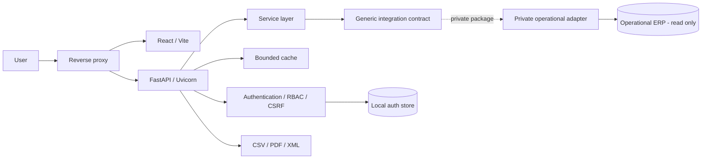

# System Guide

## Public Engineering Reference — Oncology Management Dashboard

> Public-safe reference for architecture, domain semantics, security, performance, testing and deployment strategy.

This guide describes the public application and its integration contract. Vendor-specific object names, operational SQL, production identifiers, concrete schema mappings, credentials, internal infrastructure details and troubleshooting procedures belong to the private adapter/runbook boundary.

## 1. Purpose

The Oncology Management Dashboard is a full-stack analytical platform for connecting oncology production, billing, financial receipt events, adjustments and account-level traceability.

The central engineering rule is:

> A financial indicator is only useful when its date reference, business meaning and underlying composition are explicit.

Production, billing competence and financial receipt are therefore modeled as separate dimensions.

## 2. Business flow

```text
production
  ↓
account
  ↓
billing competence
  ↓
billing batch
  ↓
invoice item
  ↓
financial receipt
  ↓
adjustment / appeal
  ↓
current balance
```

These stages can occur in different months. The system is designed to preserve that temporal separation and make the lifecycle auditable from KPI to account-level evidence.

## 3. Core time dimensions

| Dimension | Meaning |
|---|---|
| Production period | when oncology activity was produced |
| Billing competence | when the account/item entered the billing cycle |
| Receipt date | when the financial system registered the receipt event |

The platform never assumes these dates are interchangeable.

## 4. Public domain model

```text
OncologySchedule
      ↓
PatientEncounter
      ↓
AmbulatoryAccount
      ↓
BillingBatch
      ↓
InvoiceItem
      ↓
ReceiptEvent
      ├── ReceiptAdjustment
      └── AppealEvent
```

These entities describe business roles, not vendor-specific database objects.

### Entity responsibilities

- **OncologySchedule** — identifies the operational oncology cohort.
- **PatientEncounter** — represents the clinical/operational encounter.
- **AmbulatoryAccount** — represents the account tied to the encounter.
- **BillingBatch** — groups accounts/items in the billing workflow.
- **InvoiceItem** — provides item-level financial traceability.
- **ReceiptEvent** — represents a financial receipt event and its native receipt date.
- **ReceiptAdjustment** — represents additions, discounts, denials or other financial adjustments.
- **AppealEvent** — represents a recovery/appeal process when applicable.
- **PaymentReconciliation** — represents the analytical reconciliation of billed, received, adjusted and open values.

## 5. Financial semantics

### Billed value

Amount associated with an account or billing item. It must not be described as hospital cost.

### Financial receipt

Amount associated with a validated financial receipt event.

### Base receipt

When additions are represented separately:

```text
base receipt =
financial receipt - additions
```

### Estimated balance

```text
estimated balance =
max(billed - accumulated base receipts, 0)
```

### Adjustment-associated balance

```text
adjustment-associated balance =
min(estimated balance, accumulated adjustment value)
```

### Open financial balance

```text
open financial balance =
max(
  billed
  - accumulated base receipts
  - accumulated applicable adjustments,
  0
)
```

A difference between billed and received values is not automatically a denial or loss.

## 6. Financial states

The analytical layer can classify accounts into states such as:

| State | Meaning |
|---|---|
| No receipt | no accumulated base receipt |
| Received | remaining financial balance is effectively zero |
| Received with adjustment | remaining difference is explained by validated adjustments |
| Partially received | open financial balance remains |
| Partially received with adjustment | both open balance and adjustments are present |

Small monetary tolerances may be used to avoid rounding-driven classification errors.

## 7. Receipt history

A logical account may participate in multiple receipt events.

Multiple receipts are not automatically an error; they can represent legitimate partial or delayed settlement. Reversed/cancelled events must not inflate the current received amount.

## 8. Competence × receipt analysis

A central analytical question is:

> Which billing competences originated the amounts received in the selected receipt period?

```text
Billing competence A ─────┐
                          ├──► Receipt period X
Billing competence B ─────┘
```

This view intentionally preserves both dimensions.

## 9. Traceability

Important aggregates should support drill-down:

```text
Received amount
    ↓
Receipt events
    ↓
Billing batches
    ↓
Accounts
    ↓
Patients / encounters
```

The purpose is auditability rather than only descriptive reporting.

## 10. Architecture



### Public backend structure

```text
backend/app/
├── api/
├── auth/
├── exports/
├── integrations/
└── services/
```

- **api/** — HTTP routes, request validation, authorization dependencies and response handling.
- **auth/** — users, roles, sessions, CSRF and application audit events.
- **integrations/** — public adapter protocol, dynamic registry and safe unavailable default.
- **services/** — business rules, temporal semantics, metric composition and caching.
- **exports/** — CSV, PDF and XML generation.

The public repository contains no embedded operational SQL implementation and no concrete database driver.

## 11. Integration boundary

The application treats the operational ERP as an external system of record.

Public code depends on the generic contract:

```text
Application
    ↓
Domain / services
    ↓
Integration interface
    ↓
Private operational adapter
    ↓
Operational ERP
```

The private adapter owns:

- concrete database/client dependencies;
- connection management;
- operational queries;
- table/view/field mappings;
- validated internal codes;
- environment-specific configuration;
- source-specific troubleshooting.

The public repository intentionally owns none of those details.

### Adapter loading

A private deployment can provide an implementation through:

```text
DATA_ADAPTER=package.module:factory
```

If no private adapter is installed, the public backend reports the operational integration as unavailable. It does not embed guessed mappings or silently substitute production data.

## 12. Read-only rule

The operational adapter must be read-only.

The dashboard must not become a write path for patient, encounter, account, billing, receipt or adjustment records. Application-specific state such as users and sessions remains separate from the operational ERP.

## 13. Performance controls

The service layer protects the operational source through:

- maximum analytical date ranges;
- explicit row limits;
- lazy loading of expensive detail;
- bounded in-memory cache;
- TTL-based invalidation;
- single-flight loading for equivalent concurrent requests.

The exact connection-pool and source-specific tuning strategy belongs to the private adapter/runbook.

## 14. Frontend strategy

The frontend is organized around executive visibility plus drill-down.

Primary areas include:

- integrated overview;
- receipts;
- accounts and patients;
- denials/adjustments and pending items;
- analytics;
- reports;
- administration.

Large detail datasets are loaded only when the corresponding view is opened.

## 15. Security model

### Authentication and authorization

End users authenticate against the application rather than the operational ERP. RBAC separates administrative, operational, audit and read-only responsibilities.

### Passwords and sessions

Passwords use salted `scrypt` hashing. Session tokens are random, have configurable expiration and are stored as hashes in the local auth store.

### CSRF

State-changing application operations require CSRF validation.

### CORS and cookies

Credentialed CORS uses explicit origins. Production deployments should use HTTPS and secure-cookie settings.

### Repository boundary

The public repository must not contain:

- patient-identifying information;
- operational credentials;
- private keys or certificates;
- database/session artifacts;
- internal hosts or network identifiers;
- operational SQL;
- ERP schema/table/view/field mappings;
- production exports, logs or backups;
- personal names in published content.

## 16. Observability

Requests are correlated through a request identifier. Application logs can include route, method, status and elapsed time without exposing private operational mappings.

Authentication and administrative audit events are maintained in the application auth store.

## 17. Health checks

The architecture distinguishes application health from integration health.

- **Application health** — confirms the API process is running.
- **Integration health** — reports whether a compatible operational adapter is configured and available.

The public health contract does not need to expose database vendor or network details.

## 18. Configuration

Public-safe runtime categories include:

- `DATA_ADAPTER`;
- default synthetic/public payer identifier;
- auth database path;
- session lifetime;
- secure-cookie setting.

Concrete operational adapter credentials and connection descriptors are private deployment concerns.

## 19. Deployment model

```text
Client
  ↓
Reverse proxy
  ├── static frontend
  └── /api
       ↓
   application server
       ↓
   generic integration contract
       ↓
   private operational adapter
       ↓
   operational ERP
```

Exact service names, production paths, internal hosts and network layout are intentionally excluded.

## 20. Testing strategy

### Backend

Tests cover:

- authentication/session behavior;
- security helpers;
- cache behavior;
- date-range validation;
- domain/financial calculations;
- public integration-boundary behavior;
- HTTP-level application behavior.

### Frontend

The deterministic synthetic dataset is tested so the public demo preserves the intended financial semantics.

### Integration boundary

The public test suite verifies that the default adapter is unavailable rather than accidentally invoking a real operational integration.

## 21. CI

CI validates:

- required public files;
- prohibited sensitive file types;
- known internal-environment references;
- personal-name references;
- known private-adapter implementation identifiers;
- common secret patterns;
- backend lint/tests;
- frontend demo tests;
- production build;
- synthetic demo build;
- demo-container build.

A change should not be considered complete while CI is red.

## 22. Synthetic demo

The demo exists so reviewers can evaluate workflows without access to a private operational environment.

All people, accounts, financial events, identifiers and values used by demo mode are fictional.

## 23. Engineering lessons

1. **Field names alone do not prove business meaning.** A paid-status field is not a substitute for a validated receipt event.
2. **Aggregation can hide errors.** Traceability should exist before KPI presentation.
3. **Financial dates must remain explicit.** Production, competence and receipt belong to separate clocks.
4. **Operational integration requires restraint.** Cache, limits and lazy loading are source-protection controls.
5. **Financial differences require decomposition.** Billed minus received is not automatically denial or loss.
6. **Public architecture should not expose private mappings.** The application depends on a stable contract; operational implementation remains private.

## 24. Known modeling boundary

Historical competence analysis must remain careful when one logical account contains billing items associated with multiple competences.

A production-grade private adapter must validate whether allocation occurs at account grain, item × competence grain or another approved financial grain. The public repository documents the modeling issue without exposing the operational mapping.

## 25. Maintenance checklist

Before adding a metric:

1. What business question does it answer?
2. Which date defines its period?
3. What is the aggregation grain?
4. Can joins or adapter composition duplicate values?
5. Can events be reversed?
6. Is the amount billed, received, adjusted or cost?
7. Is drill-down available?
8. What is the null behavior?
9. What monetary tolerance is acceptable?
10. Could the request overload the operational source?

Before release:

1. run backend lint/tests;
2. run frontend tests/build;
3. validate synthetic demo;
4. build the demo container;
5. confirm repository hygiene;
6. review documentation for private implementation details;
7. confirm CI is green.

## 26. Summary

Five principles explain most of the system:

1. **Production, billing competence and receipt are different business clocks.**
2. **Operational status is not a substitute for a financial receipt event.**
3. **Financial values should remain traceable to account/item composition.**
4. **Billed minus received is not automatically a denial.**
5. **The operational ERP implementation belongs behind a private read-only adapter.**

These principles should remain stable even if the underlying ERP, database technology or deployment environment changes.
